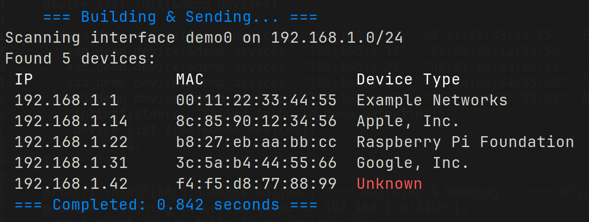

# NetScan

NetScan is a small C network scanner that discovers devices on a local IPv4 network with ARP requests and labels each device with a vendor name from an OUI database.

It is intended as a practical systems/networking project: it uses raw packet capture through `libpcap`, keeps scan results in a simple dynamic device list, and formats discovered IP, MAC, and vendor data for quick terminal review.

## Features

- Sends ARP discovery packets across the configured local subnet.
- Captures ARP replies with `libpcap`.
- Deduplicates devices by MAC address.
- Resolves MAC prefixes to vendor names using the included OUI database.
- Installs a global `netscan` command that can be run from any directory.

## Demo


## Requirements

NetScan currently targets Linux.

Install build dependencies on Debian or Ubuntu:

```sh
sudo apt update
sudo apt install build-essential libpcap-dev
```

Scanning uses packet capture and packet injection, so the installed command usually needs elevated privileges:

```sh
sudo netscan
```

## Build

```sh
make
```

Run from the repository:

```sh
make run
```

View command help:

```sh
./build/netscan --help
```

Print screenshot-safe sample output without scanning the network:

```sh
./build/netscan --demo
```

## Install

Install to `/usr/local`:

```sh
sudo make install
```

After installation, run it from any directory:

```sh
sudo netscan
```

NetScan automatically selects the first non-loopback IPv4 interface with a MAC address. To scan with a specific interface:

```sh
sudo netscan -i wlp0s20f3
```

List available interfaces with:

```sh
ip addr
```

For documentation, portfolios, or screenshots, use demo mode instead of showing a real LAN scan:

```sh
netscan --demo
```

Install somewhere else by overriding `PREFIX`:

```sh
make PREFIX="$HOME/.local" install
```

Make sure the selected `bin` directory is on your `PATH`.

## Uninstall

```sh
sudo make uninstall
```

Use the same `PREFIX` value for uninstall if you installed somewhere other than `/usr/local`.

## Project Structure

```text
include/   Public headers for scanner, device list, and OUI lookup modules
src/       C source files
data/      OUI vendor database used for MAC vendor lookup
Makefile   Build, install, run, and cleanup targets
```

## Notes

This tool is designed for scanning networks you own or are authorized to inspect. ARP discovery is local-network only and does not scan across routed networks.

## Data Attribution

NetScan includes a local copy of Wireshark's `manuf` MAC address vendor database for offline OUI lookup. The source file was downloaded from:

```text
https://www.wireshark.org/download/automated/data/manuf
```

Wireshark identifies the canonical compressed source as:

```text
https://www.wireshark.org/download/automated/data/manuf.gz
```

The NetScan source code is licensed under the MIT License. The included `manuf` data remains attributable to the Wireshark project and its upstream data sources.
